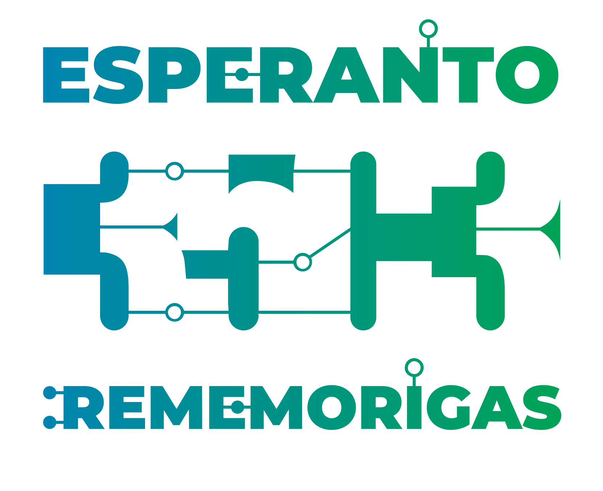

# Esperanto course at 35c3

{ width=33% }

## Quick facts

* released 1887 by L. L. Zamenhof, Poland (at the time Russia)
* $10^6$ speakers; $10^3$ natives, $10^6$ fluent regulars, $10^6$ "started to
  learn"

## Simple dialog

* Saluton! Mi estas Johannes. Kiu vi estas?
* Saluton! Mi nomiĝas Eva.
* Ĉu plaĉas al vi la kongreso?
* Jes treege.

## Let's deduce some gramar basics

### Personal pronouns
* mi
* vi
* li/ŝi/ĝi
* ni
* vi
* ili

### Verbs

* Infinitive: *-i* (esti, nomiĝi, plaĉi)
* Present tense: *-as* (estas, nomiĝas, plaĉas)
* Past tense: *-is* (estis, nomiĝis, plaĉis)
* Future tense: *-os* (estos, nomiĝos, plaĉos)

* vidi, aŭdi, ami, manĝi, trinki, drinki, ...

### Nouns

* *-o* (kongreso, kurso, lingvo, tablo, seĝo, fenstro, pomo, ...)
* plural: *-j* (kongresoj, kursoj, lingvoj, tabloj, seĝoj, fenstroj, homoj, ...)

### Adjectives

* *-a* (bela, granda, ruĝa, verda, kongresa, dolĉa, plaĉa)
* plural: *-j* (belaj, grandaj, ruĝaj, verdaj, kongresaj, dolĉaj, plaĉaj)

### Accusative

*-n*

Examples:

* Mi amas vi*n*
* Ĉu vi ŝatas la kongreso*n*?
* Ŝi manĝas dolĉaj*n* pomoj*n*.

### Affixes

*-eg-*: granda → grand*eg*a

*mal-*: granda -> *mal*granda

### The power of affixes

|        | -in-       | -id-       | -ar-       |
|:-------|:-----------|:-----------|:-----------|
| ŝafo   | ŝaf*in*o   | ŝaf*id*o   | ŝaf*ar*o   |
| hundo  | hund*in*o  | hund*id*o  | hund*ar*o  |
| bovo   | bov*in*o   | bov*id*o   | bov*ar*o   |
| ĉevalo | ĉeval*in*o | ĉeval*id*o | ĉeval*ar*o |

|        | -il-     | -ej-     | -ist-     | -ind-     | -em-     | -il-ar-    | -em-ul-    |
|:-------|:---------|:---------|:----------|:----------|:---------|:-----------|:-----------|
| lerni  | lernilo  | lernejo  | lernisto  | lerninda  | lernema  | lernilaro  | lernemulo  |
| manĝi  | manĝilo  | manĝejo  | manĝisto  | manĝinda  | manĝema  | manĝilaro  | manĝemulo  |
| muziko | muzikilo | muzikejo | muzikisto | muzikinda | muzikema | muzikilaro | muzikemulo |
| naĝi   | naĝilo   | naĝejo   | naĝisto   | naĝinda   | naĝema   | naĝilaro   | naĝemulo   |
| haki   | hakilo   | hakejo   | hakisto   | hakinda   | hakema   | hakilaro   | hakemulo   |

## Resources

### Learning

* [Duolingo](https://www.duolingo.com/course/eo/en)
* [lernu](https://lernu.net)

### Music

* [Awesome Esperanto music videos](https://www.youtube.com/watch?v=gWiH8BlpU0U&list=PLLg4HNcQo8zx3IMEXcrnRCkEhyXWDDf37)
* [Vinilkosmo – Music label](https://www.vinilkosmo-mp3.com/en/)

### Congresses meetups

* [Esperanto world
  congress](https://en.wikipedia.org/wiki/World_Esperanto_Congress)
* [International Youth
  Congres](https://en.wikipedia.org/wiki/International_Youth_Congress)
* [Esperanto summer studies](https://ses.ikso.net)
* [Esperanto news week](http://jes.pej.pl)
